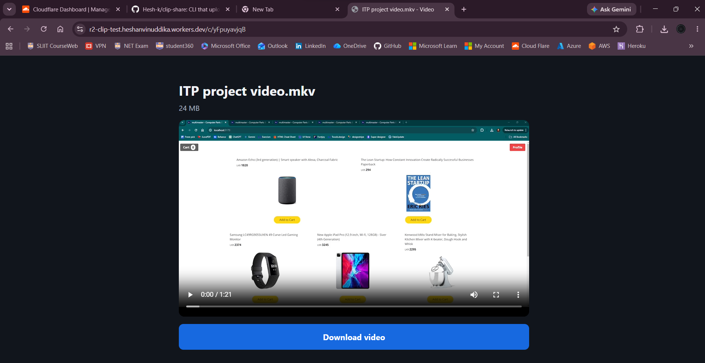

# r2-clip-share



A small TypeScript proof of concept for uploading video clips to a **private** Cloudflare R2 bucket and sharing them through a Cloudflare Worker. The bucket is never exposed publicly; the Worker is the only viewing and download endpoint.

## Prerequisites

- Node.js 20 or newer and npm for the CLI. Current Wrangler releases require Node.js 22 or newer for Worker development and deployment.
- A Cloudflare account with R2 enabled
- Wrangler access to deploy a Worker
- A private R2 bucket and an R2 API token with Object Read & Write access scoped to that bucket

## One-time setup

1. Create a private R2 bucket in Cloudflare. Do not enable public access or an `r2.dev` URL.
2. Create an R2 API token with Object Read & Write permission scoped to this bucket.
3. Copy `.env.example` to `.env` and fill in the account ID, token credentials, bucket name, and the public Worker URL. Keep `.env` private.
4. In `worker/wrangler.jsonc`, replace `replace-with-your-private-r2-bucket` with the same bucket name.
5. Install dependencies:

   ```powershell
   npm install
   ```

## Deploy the Worker

Log into Cloudflare through Wrangler and deploy:

```powershell
npx wrangler login
npm run deploy --workspace @r2-clip-test/worker
```

The Worker has `workers_dev` enabled. Use the deployed `https://<worker>.<subdomain>.workers.dev` URL as `PUBLIC_BASE_URL` in `.env`. The Worker has a direct R2 binding named `CLIPS`; it does not use the CLI credentials.

## CLI

After filling in `.env`, run a credential and bucket check:

```powershell
npm run cli -- check
```

Upload supported videos from a single folder (the scan is non-recursive):

```powershell
npm run cli -- upload ./clips
```

Other commands:

```powershell
npm run cli -- upload ./clips --dry-run
npm run cli -- upload ./clips --concurrency 2
npm run cli -- list
npm run cli -- delete abc1234567
npm run cli -- delete abc1234567 --yes
```

The CLI supports `.mp4`, `.webm`, `.mov`, `.m4v`, and `.mkv`. It streams files, checks uploaded object sizes, and records SHA-256-to-ID mappings in the ignored local `.r2-manifest.json` file.

## End-to-end walkthrough

1. `npm install`
2. `npm run cli -- check`
3. `npm run cli -- upload ./clips`
4. Open the printed link on desktop and phone and verify playback, seeking, and download.

## Troubleshooting

- **Missing environment variable / Invalid configuration**: Fill every required value in `.env`: `R2_ACCOUNT_ID`, `R2_ACCESS_KEY_ID`, `R2_SECRET_ACCESS_KEY`, `R2_BUCKET`, and `PUBLIC_BASE_URL`.
- **Wrong account ID or endpoint / network error**: Confirm the account ID belongs to the bucket's Cloudflare account and that the account ID in `.env` is correct. The endpoint is derived from that ID.
- **SignatureDoesNotMatch**: Check the account ID, endpoint, access key ID, and secret access key. Recreate the API token if its secret was copied incorrectly.
- **AccessDenied**: The API token needs Object Read & Write permissions and must be scoped to the selected bucket.
- **NoSuchBucket / Bucket not found**: Confirm the bucket exists, and that `R2_BUCKET` and the Worker binding's `bucket_name` exactly match.
- **Worker link returns 404**: Verify the Worker is deployed and attached to the same bucket; confirm the clip ID and key have not been deleted.
- **Local `wrangler dev` cannot see CLI uploads**: `wrangler dev` uses a local simulated bucket by default. Test with the deployed Worker, or run `npx wrangler dev --remote` to use remote resources.

## Development checks

```powershell
npm run typecheck
npm test
```
